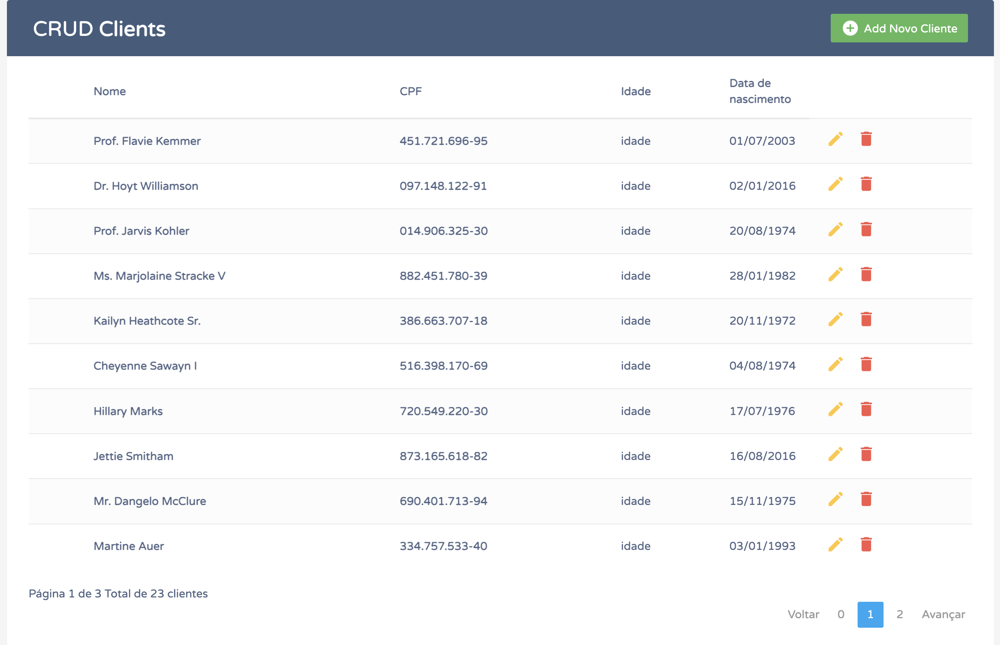

### Passo a passo
Clone Repositório
```sh
git clone 
git@github.com:souza-wallace/CRUD-Laravel.git
```
```sh
cd CRUD-Laravel
```

Crie o Arquivo .env
```sh
cp .env.example .env
```

Instale as dependências do projeto
```sh
composer install
```

Rode as migrações.
```sh
php artisan migrate
```
Rode as o seed, ele ira popular o banco de dados com clientes.
```sh
php artisan db:seed
```

Acesse o projeto
[http://localhost:8000](http://localhost:8000)


O projeto é um CRUD simples de clientes.
obs: para visualizar dados do cliente clique no nome ou no cpf.

